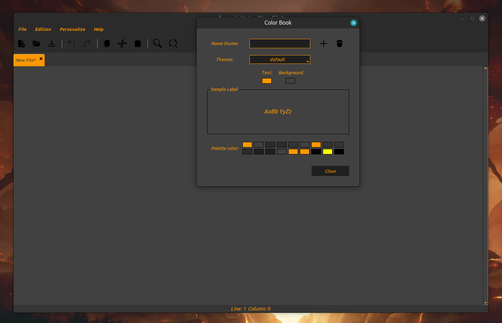

# NotePad:

Simple and customizable text editor using tkinter




## Requirements

- Python 3.12.3
- Tkinter

## 1. Clone the repository

```sh
git clone git@github.com:Devnk30/NotePad.git
cd NotePad.git
```

## Create and Activate the Virtual Environment

```sh
python3 -m venv NotePad-venv 
source venv/bin/activate
```

## Run the application

```sh
python3 bin/main.py
```

## Config File

The config.json file contains the settings for fonts, styles, and colors of the application.
These colors will be stored sorted by theme, followed by a color palette.

```json
{
  "font": {
    "fontname": "Ubuntu Sans",
    "fontsize": "12",
    "fontstyle": "normal italic"
  },
  "select_theme": "default",
  "themes": {
    "default": {
      "color1": "#ff9700",
      "color2": "#414141",
      "color3": "#2b2b2b",
      "color4": "#2b2b2b",
      "color5": "#353535",
      "color6": "#414141",
      "color7": "#ff9700",
      "color8": "#353535",
      "color9": "#353535",
      "color10": "#2b2b2b",
      "color11": "#1F1F1F",
      "color12": "#1F1F1F",
      "color13": "#414141",
      "color14": "#ff9700",
      "color15": "#ff9700",
      "color16": "#000000",
      "color17": "#fffb00",
      "color18": "#000000"
    },
  }
}
```
